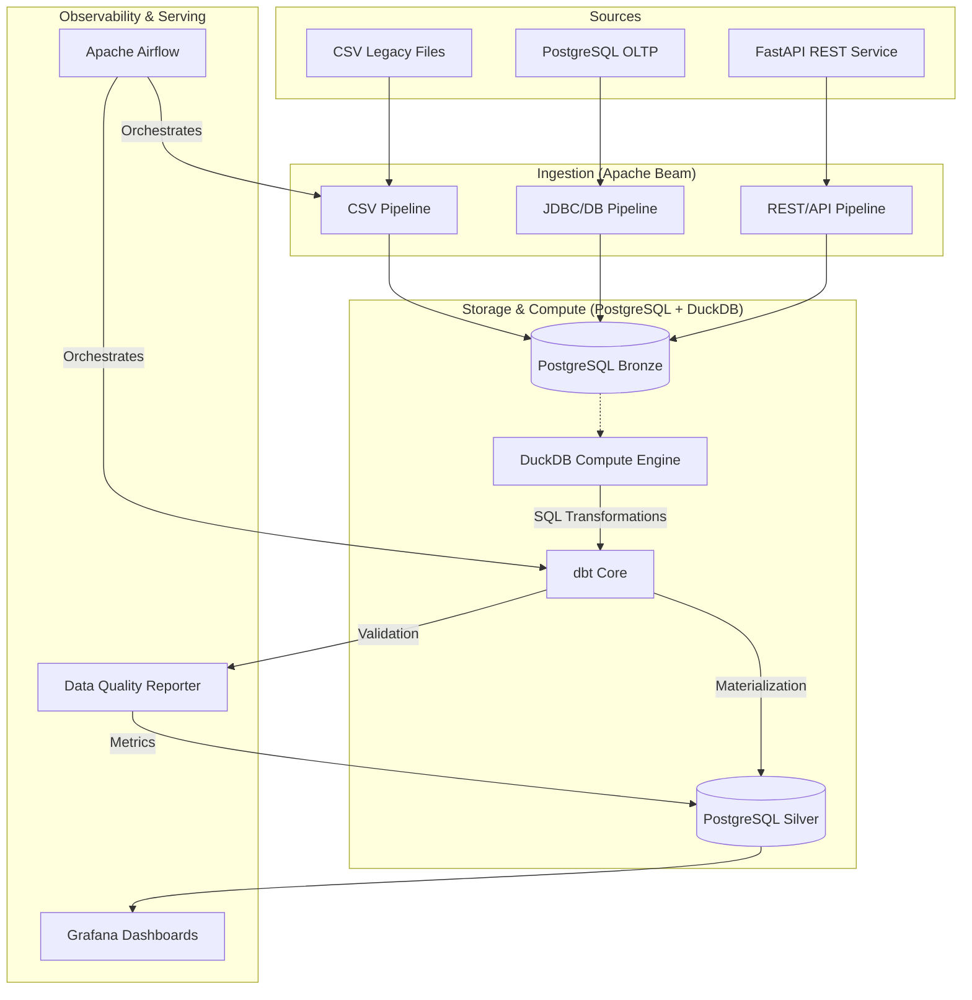

# E-Commerce Data Platform — PFE Data Engineering

**End-to-end data engineering platform built on the E-Commerce dataset.**  
Covers the full data value chain: multi-source ingestion → structured storage → ELT transformation → analytical serving.

---

## Overview

This platform was designed and built as a Final Year Engineering Project (PFE), it demonstrates production-grade data engineering practices applied to a real-world e-commerce dataset of ~100,000 orders across 9 relational tables.

The architecture follows the **ELT paradigm** with a clear separation of concerns:

- **Extract & Load** — Apache Beam pipelines ingest data from three heterogeneous sources into a structured Bronze landing zone (PostgreSQL)
- **Transform** — dbt-core running on DuckDB transforms raw Bronze data into clean Silver models and business-ready Gold aggregations
- **Quality** — A three-level cascade (Drift Detection → GE Validation → dbt Tests) ensures no corrupted data reaches analytical layers
- **Serve** — A read-only Gold layer exposes data to BI tools, SQL analysts, and ML pipelines

---

## Architecture

My architecture leverages **PostgreSQL** for persistent storage (Landing/Bronze) and **DuckDB** as a high-performance OLAP engine for transformations (Silver).


CROSS-CUTTING LAYER
───────────────────
Observability  : Prometheus + Grafana
Data Quality   : Great Expectations + dbt tests + DQ Reporter
DataOps        : GitHub Actions CI/CD
Schema Control : PyArrow Schema Registry + Drift Detector

---

## Technology Stack

| Layer | Technology | Version | Role |
|---|---|---|---|
| Ingestion | Apache Beam (DirectRunner) | 2.54.0 | 3 batch pipelines — CSV, JDBC, REST |
| Storage | PostgreSQL | 15 | Structured landing zone (Bronze) |
| Compute | DuckDB | 0.10.3 | OLAP analytical engine via `postgres_scanner` |
| Transformation | dbt-core + dbt-duckdb | 1.7.x | ELT Bronze → Silver → Gold |
| Orchestration | Apache Airflow | 2.9.1 | DAG scheduling, retry, SLA monitoring |
| Data Quality | Great Expectations + dbt tests | 0.18.19 | Entry validation + model integrity |
| Monitoring | Prometheus + Grafana | latest | Infrastructure & pipeline observability |
| API Mock | FastAPI + Uvicorn | 0.111.0 | Simulates products & sellers REST source |
| Catalog | dbt docs | — | Lineage graph, model documentation |
| Containerization | Docker Compose v2 | — | Self-contained Phase A platform |

---

## Data Sources

The 9 tables are distributed across 3 source types to simulate real enterprise ingestion patterns:

| Source | Tables | Pattern | Justification |
|---|---|---|---|
| **CSV Legacy** | `geolocation`, `category_translation` | Full Refresh | Static reference data, no reliable timestamp |
| **PostgreSQL OLTP** | `orders`, `customers`, `order_items`, `order_payments`, `order_reviews` | Incremental watermark (`orders`) + Full Refresh | Transactional data with timestamps |
| **FastAPI REST** | `products`, `sellers` | Full Refresh (paginated) | External catalog API, no timestamp guarantee |

---


## Project Structure

```
pfe-data-platform/
│
├── airflow/
│   ├── dags/                        # DAG definitions (e-commerce_elt_pipeline)
│   ├── logs/                        # Airflow execution logs (gitignored)
│   └── plugins/                     # Custom Airflow plugins
│
├── api/
│   ├── main.py                      # FastAPI mock — /products, /sellers, /health
│   └── data/                        # CSV files served by the API
│
├── data/
│   ├── raw/                         # Source CSV files — read-only, never modified
│   │   ├── csv_source/              # geolocation.csv, product_category_name_translation.csv
│   │   └── postgres_source/         # Seed files for OLTP simulation
│   └── processed/
│       └── watermarks.json          # Incremental watermark state (gitignored)
│
├── dbt/
│   ├── models/
│   │   ├── silver/                  # 9 staging models (stg_*)
│   │   └── gold/                    # Facts, dimensions, marts (Sprint 4)
│   ├── macros/
│   │   └── deduplicate.sql          # Generic deduplication macro (QUALIFY + ROW_NUMBER)
│   ├── profiles.yml                 # DuckDB connection profile
│   ├── dbt_project.yml              # Project configuration
│   └── packages.yml                 # dbt-utils dependency
│
├── docker/
│   ├── docker-compose.yml           # Full platform — 10 services
│   ├── Dockerfile                   # Airflow image + Python data dependencies
│   ├── Dockerfile.dbt               # dbt-docs image (catalog on port 8085)
│   ├── Dockerfile.fastapi           # FastAPI mock image
│   └── monitoring/
│       ├── prometheus.yml           # Scrape configuration
│       └── grafana/
│           ├── datasources/         # PostgreSQL + Prometheus auto-provisioning
│           └── dashboards/          # Data Quality dashboard (JSON)
│
├── src/
│   ├── ingestion/
│   │   ├── pipeline_csv_to_bronze.py    # Pipeline 1 — CSV → Bronze
│   │   ├── pipeline_db_to_bronze.py     # Pipeline 2 — OLTP → Bronze (incremental)
│   │   ├── pipeline_api_to_bronze.py    # Pipeline 3 — REST API → Bronze
│   │   └── io/
│   │       ├── postgres_writer.py       # Reusable WriteToBronze DoFn (bulk insert)
│   │       └── postgres_reader.py       # Reusable ReadFromPostgres DoFn
│   ├── quality/
│   │   ├── schema_registry.py           # PyArrow schema contracts — 9 tables
│   │   ├── ge_validator.py              # GE validation DoFn (inline in Beam)
│   │   ├── drift_detector.py            # Schema drift detection (Airflow Task 0)
│   │   └── dq_reporter.py               # DQ score computation → quality.dq_metrics
│   └── scripts/
│       ├── init_bronze_schema.py        # One-time Bronze schema initialization
│       └── seed_oltp.py                 # Seeds OLTP source from CSV files
│
├── tests/                           # pytest unit and integration tests
├── docs/                            # Architecture docs, ADRs
├── notebooks/                       # EDA and prototyping
│
├── .env.example                     # Environment variable template
├── .gitignore
├── .python-version                  # Python 3.11
├── requirements.txt                 # Production Python dependencies
└── requirements-dev.txt             # Dev dependencies (linting, testing)
```

---

## Getting Started

### Prerequisites

- Python 3.11+
- Docker Desktop 24+ with Docker Compose v2
- Git

### 1. Clone the repository

```bash
git clone https://github.com/HamzaElOuali/pfe-data-platform.git
cd pfe-data-platform
```

### 2. Configure Python environment

```bash
python -m venv .venv

# Windows PowerShell
.venv\Scripts\Activate.ps1

# Linux / macOS
source .venv/bin/activate

pip install -r requirements.txt
pip install -r requirements-dev.txt
```

### 3. Set environment variables

```bash
cp .env.example .env
# Edit .env with your credentials — never commit this file
```

### 4. Seed the OLTP source database

```bash
python -m src.scripts.seed_oltp
```

### 5. Initialize the Bronze schema

```bash
python -m src.scripts.init_bronze_schema
```

### 6. Start the platform

```bash
cd docker
docker-compose up -d
```

### 7. Run the ingestion pipelines

```bash
python -m src.ingestion.pipeline_csv_to_bronze
python -m src.ingestion.pipeline_db_to_bronze
python -m src.ingestion.pipeline_api_to_bronze
```

### 8. Run dbt transformations

```bash
cd dbt
dbt run --select silver
dbt test --select silver
```

### 9. Run tests

```bash
python -m pytest tests/ -v
```

---

## Services

Once the platform is running, the following interfaces are available:

| Service | URL | Description |
|---|---|---|
| Airflow UI | http://localhost:8080 | Pipeline orchestration and monitoring |
| FastAPI Swagger | http://localhost:8090/docs | REST API mock documentation |
| dbt Catalog | http://localhost:8085 | Data lineage and model documentation |
| Prometheus | http://localhost:9090 | Metrics collection |
| Grafana | http://localhost:3000 | Data quality and infrastructure dashboards |
| pgAdmin | http://localhost:5050 | PostgreSQL administration |

> **Security note:** Default credentials are defined in `.env.example`. Always change them before any deployment. Never commit your `.env` file.

---

## Medallion Architecture

### Bronze Layer — Raw Landing Zone

PostgreSQL schema `bronze` in `postgres_dwh`. Stores raw data exactly as received from sources with governance metadata appended by each pipeline:

| Metadata Column | Pipeline | Description |
|---|---|---|
| `_ingested_at` | All | UTC timestamp of ingestion |
| `_source_file` | CSV | Source filename |
| `_batch_id` | OLTP | UUID identifying the pipeline run |
| `_api_version` | REST | API version at time of fetch |

Tables are created with **explicit types** defined by the PyArrow Schema Registry — no dynamic schema inference. Full Refresh pipelines truncate before writing to guarantee idempotence.

**Current Bronze volumes:**

| Table | Rows | Source |
|---|---|---|
| geolocation | 1,000,163 | CSV |
| product_category_name_translation | 71 | CSV |
| orders | 99,441 | PostgreSQL OLTP |
| customers | 99,441 | PostgreSQL OLTP |
| order_items | 112,650 | PostgreSQL OLTP |
| order_payments | 103,886 | PostgreSQL OLTP |
| order_reviews | 99,224 | PostgreSQL OLTP |
| products | 32,951 | FastAPI REST |
| sellers | 3,095 | FastAPI REST |

**Total: 1,550,074 rows across 9 tables.**

### Silver Layer — Curated Zone

Produced by dbt-core running on DuckDB via `postgres_scanner`. Each `stg_*` model applies:

- **Type casting** — all timestamps, floats, and integers explicitly cast from TEXT
- **PII masking** — `customer_id`, `customer_unique_id`, `seller_id` hashed via SHA-256; `review_comment_message` replaced by `has_comment` boolean
- **Normalization** — city and state fields uppercased and trimmed
- **Derived columns** — `delivery_days`, `is_late`, `total_value`, `response_hours`
- **Business rule validation** — price ≥ 0, freight ≥ 0, review score ∈ [1,5], coordinates within Brazil bounds
- **Deduplication** — generic `deduplicate` macro using DuckDB `QUALIFY` + `ROW_NUMBER()`
- **NULL handling** — primary key NULLs rejected; `product_category_name` defaulted to `'unknown'`; optional timestamps preserved as NULL

**PII policy:**

| Field | Treatment | Reaches Gold |
|---|---|---|
| `customer_id` | SHA-256 hash | Hash only |
| `customer_unique_id` | SHA-256 hash | Hash only |
| `seller_id` | SHA-256 hash | Hash only |
| `review_comment_message` | Replaced by `has_comment` boolean | Boolean only |

### Gold Layer — Business-Ready SSOT *(Sprint 4)*

Facts, dimensions, and KPI marts built on top of Silver. Zero PII. All consumers (analysts, BI tools, ML pipelines) read exclusively from Gold.

---

## Data Quality

The platform implements a **three-level quality cascade** to prevent corrupted data from reaching analytical layers.

### Level 1 — Before Ingestion: Drift Detector

`src/quality/drift_detector.py` runs as Airflow Task 0 before any pipeline starts. It compares the actual schema of `postgres_source` tables against the PyArrow contracts in the Schema Registry.

- Missing expected column → **CRITICAL** — pipeline stops immediately
- Unknown new column → **WARNING** — logged, pipeline continues

### Level 2 — During Ingestion: GE Validator

`src/quality/ge_validator.py` is a Beam DoFn injected into every pipeline between metadata enrichment and Bronze write. It validates each record against:

- All expected columns present (`expect_column_to_exist`)
- Primary key columns not null (`expect_column_values_to_not_be_null`)

On failure: record is logged to `logs/ingestion_errors.jsonl`, a `RuntimeError` is raised, the pipeline stops, and the Airflow task is marked `FAILED`. Nothing is written to Bronze.

### Level 3 — After Transformation: dbt Tests

`dbt/models/silver/schema.yml` defines integrity constraints applied after each dbt run:

- `unique` + `not_null` on all primary keys
- `accepted_values` on `order_status` (8 values) and `review_score` (1–5)
- `accepted_range` (≥ 0) on `price` and `payment_value`

A failed test blocks Gold layer promotion.

### DQ Reporting

`src/quality/dq_reporter.py` reads `dbt/target/run_results.json` after each test run, computes a global quality score `(pass_count / total_tests × 100)`, and inserts it into `quality.dq_metrics` in PostgreSQL. This table feeds the Grafana **Data Quality Dashboard** with historical tracking and threshold alerting (red < 85%, yellow 85–95%, green > 95%).

---

## Orchestration

The DAG `e-commerce_elt_pipeline` runs daily and enforces strict execution order:

```
check_source_drift
        │
        ▼
┌───────────────────────────────────┐
│  ingest_csv   ingest_db  ingest_api  │  ← parallel
└───────────────┬───────────────────┘
                │
                ▼
          dbt_run_silver
                │
                ▼
         dbt_test_silver
                │
                ▼
        generate_dq_report
```

Retry policy: 1 retry with 5-minute delay on any task failure.

---

## Development Guidelines

### Branch convention

```
feature/[JIRA-KEY]-short-description    # new features
fix/[JIRA-KEY]-short-description        # bug fixes
```

### Commit convention

```
[ESP-D1] init: setup repository and gitignore
[ESP-D2] feat: add project structure and Python environment
[ESP-D3] infra: containerize data platform services
[ESP-D4] feat: implement bronze ingestion pipelines
```

### Pull Request process

1. Branch from `dev` using `feature/` or `fix/` prefix
2. Commit with the Jira ticket key
3. Open PR targeting `dev` — minimum 1 reviewer required
4. Merge after approval
5. `dev` → `main` via protected PR only

---

## Data Governance Rules

- `data/raw/` is **read-only** — never modified by any pipeline
- `data/processed/` is gitignored — never committed
- No `.csv`, `.parquet`, or `.db` files in the repository
- No secrets in plain text — use `.env` (gitignored)
- PII fields are masked at Silver layer — zero PII in Gold
- All schema changes go through the PyArrow Schema Registry first

---

## Phase B — GCP Mapping *(Roadmap)*

| Phase A (On-Premises) | Phase B (GCP) | Migration effort |
|---|---|---|
| Apache Beam DirectRunner | Dataflow (BeamRunner) | Swap runner config only |
| PostgreSQL Bronze | Google Cloud Storage (GCS) | Change connection string |
| DuckDB | BigQuery | Swap dbt adapter |
| Apache Airflow | Cloud Composer | Reuse same DAGs |
| Docker Compose | Terraform (IaC) | Infrastructure as code |

The codebase is designed for this migration from day one — no logic rewrites required, only configuration changes.

---

## Author

**Hamza EL OUALI**  
