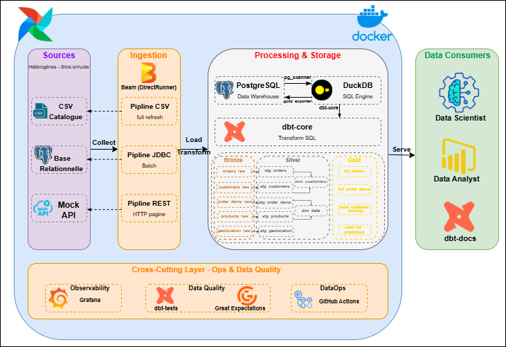

# E-Commerce Data Platform - PFE Data Engineering

**End-to-end data engineering platform built on a real-world e-commerce dataset.**  
Covers the full data value chain: ingestion from the Kaggle API → structured storage → ELT transformation → analytical serving → ML predictions → AI-powered recommendations.

---

## Overview

This platform was designed and built as a Final Year Engineering Project (PFE). It demonstrates production-grade data engineering practices applied to a real-world e-commerce dataset of ~100,000 orders across 9 relational tables.

The architecture follows the **ELT paradigm** with a clear separation of concerns:

| Phase | Description |
|---|---|
| **Extract & Load** | Apache Beam pipelines ingest data from the Kaggle API into a structured Bronze landing zone (PostgreSQL) |
| **Transform** | dbt-core running on DuckDB transforms raw Bronze data into clean Silver models and business-ready Gold aggregations |
| **Quality** | A three-level cascade (Drift Detection → GE Validation → dbt Tests) ensures no corrupted data reaches analytical layers |
| **Serve** | A read-only Gold layer exposes data to BI tools, SQL analysts, and ML pipelines |
| **Predict** | XGBoost & LightGBM models score every order for delivery delay risk and customer segmentation |
| **Recommend** | A FastAPI layer backed by Mistral 7B (via OpenRouter) generates natural language recommendations from ML scores |

---

## Architecture



---

## Medallion Architecture

### Bronze Layer — Raw Landing Zone

PostgreSQL schema `bronze` in `postgres_dwh`. Stores raw data exactly as received from source with governance metadata:

| Metadata Column | Description |
|---|---|
| `_ingested_at` | UTC timestamp of ingestion |
| `batch_id` | UUID identifying the pipeline run |

Tables are created with **explicit types** defined by the PyArrow Schema Registry. Full Refresh pipelines truncate before writing to guarantee idempotence.

**Bronze volumes:**

| Table | Rows | Source |
|---|---|---|
| geolocation | 1,000,163 | CSV |
| product_category_name_translation | 71 | CSV |
| orders | 99,441 | PostgreSQL OLTP |
| customers | 99,441 | PostgreSQL OLTP |
| order_items | 112,650 | PostgreSQL OLTP |
| order_payments | 103,886 | PostgreSQL OLTP |
| order_reviews | 99,224 | PostgreSQL OLTP |
| products | 32,951 | PostgreSQL OLTP |
| sellers | 3,095 | PostgreSQL OLTP |

**Total: 1,550,074 rows across 9 tables.**

---

### Silver Layer — Curated Zone

Produced by dbt-core running on DuckDB via `postgres_scanner`. Each `stg_*` model applies:

- **Type casting** — all timestamps, floats, and integers explicitly cast from TEXT
- **PII masking** — `customer_id`, `customer_unique_id`, `seller_id` hashed via SHA-256; `review_comment_message` replaced by `has_comment` boolean
- **Normalization** — city and state fields uppercased and trimmed
- **Derived columns** — `delivery_days`, `is_late`, `total_value`, `response_hours`
- **Business rule validation** — price ≥ 0, freight ≥ 0, review score ∈ [1,5], coordinates within Brazil bounds
- **Deduplication** — generic `deduplicate` macro using DuckDB `QUALIFY ROW_NUMBER()`
- **NULL handling** — primary key NULLs rejected; optional timestamps preserved as NULL

**PII Policy:**

| Field | Treatment | Reaches Gold |
|---|---|---|
| `customer_id` | SHA-256 hash | Hash only |
| `customer_unique_id` | SHA-256 hash | Hash only |
| `seller_id` | SHA-256 hash | Hash only |
| `review_comment_message` | Replaced by `has_comment` boolean | Boolean only |

---

### Gold Layer — Business-Ready SSOT

The Gold layer transforms curated Silver data into **decision-ready assets**, structured around two axes:

**Star Schema (Bus Matrix — Kimball):**
- `dim_customers` — Geo-enriched, anonymized
- `dim_sellers` — Secured with hashed IDs
- `dim_products` — Category-translated
- `dim_date` — Standard date dimension
- `fct_orders` — SLA & logistics facts
- `fct_order_items` — Sales facts
- `fct_order_reviews` — Satisfaction facts

**ML & Analytics Marts:**
- `mart_ml_prediction_master` — Feature store with 20+ variables (Haversine distance, weight, delays, geography)
- `mart_customer_scoring` — Churn risk scores and customer segments (VIP, At Risk) via SQL rules

**Analytics Views (Power BI / Analyst Ready):**
- `vw_sales_performance` — Revenue & profitability analysis
- `vw_logistics_sla` — Delay monitoring & carrier performance
- `vw_customer_sentiment` — Logistics–satisfaction correlation (VoC)
- `vw_customer_risk_360` — Proactive retention management

**Gold Export:** `gold_exporter.py` synchronizes all 13 Gold assets (tables + views) from DuckDB to the `gold` schema in PostgreSQL for concurrent access.

---

## Sprint History

### Sprint 4 — Platform Industrialization

**Orchestration (Apache Airflow)**  
The DAG `main_pipeline_dag.py` implements a Fail-Fast pattern:
- Health checks via `PostgresHealthSensor` and `APIHealthSensor`
- Ingestion → dbt Silver → Data Quality → dbt Gold → Scoring
- `@daily` schedule with manual trigger support

**Normalizer Module (`normalizer.py`):**

| Technique | Description |
|---|---|
| Imputation | Missing values filled by median or constant |
| Outlier capping | IQR method (factor 1.5) |
| Standardization | String trim, uppercase, regex cleaning |

**Data Quality — 21 automated test points:**
1. **Identity (14 tests)** — `unique` + `not_null` on all primary keys
2. **Referential integrity (3 tests)** — FK validation on `order_items`, `order_payments`
3. **Business domain (4 tests)** — Status enum, price ≥ 0, score ∈ [1,5]

---

### Sprint 5 — Gold Layer & Serving

- Implemented full **Star Schema** (Bus Matrix) with 4 dimensions and 3 fact tables
- Created **ML Marts** for feature engineering and customer scoring
- Built **4 analytics views** ready for Power BI / direct analyst consumption
- Automated Gold export (`gold_exporter.py`) to PostgreSQL
- Cloud infrastructure provisioned via **Terraform on GCP** (Compute Engine VM, GCS bucket, Firewall rules)

---

### Sprint 6 — ML Prediction Layer & React Frontend

This sprint operationalized the platform end-to-end by adding a machine learning inference layer and a production-grade web interface.

#### ML Prediction Layer

Three models trained on the Gold mart and serialized to `/models/`:

| Model | File | Algorithm | Target |
|---|---|---|---|
| Delay predictor | `model1_delay.pkl` | XGBoost | Binary: will the order be late? |
| Risk scorer | `model2_risk.pkl` | LightGBM | Risk score [0–1] |
| Segment classifier | `model3_segment.pkl` + `scaler3.pkl` | KMeans + StandardScaler | Customer segment (VIP / Standard / At Risk) |

The `scoring_pipeline.py` runs batch inference against the Gold mart and writes results back to PostgreSQL.

#### FastAPI Mock & Scoring Server (`api/`)

The FastAPI service (port **8090**) exposes:

| Endpoint | Method | Description |
|---|---|---|
| `/health` | GET | Liveness check |
| `/products` | GET | Product catalog from CSV |
| `/sellers` | GET | Sellers reference data |
| `/score/order` | POST | Real-time order risk scoring (XGBoost + LightGBM) |
| `/score/batch` | POST | Batch scoring endpoint |
| `/recommend` | POST | AI recommendation via Mistral 7B |
| `/metrics` | GET | Prometheus-compatible metrics |

#### AI Recommender (`api/ai_recommender.py`)

Integrates **Mistral 7B Instruct** via the **OpenRouter API** to generate natural language business recommendations from ML scores. Each scored order gets a contextual recommendation (logistics risk, fulfillment advice, customer retention action) returned alongside the numeric prediction.

Configure with `OPENROUTER_API_KEY` in `.env`.

#### React + Vite Frontend (port **3001**)

A production-built single-page application served by Nginx, with three pages:

| Page | Route | Description |
|---|---|---|
| **Order Intelligence** | `/orders` | Submit an order for real-time ML scoring + AI recommendation |
| **Platform Status** | `/status` | Live health status of all platform services |
| **Segment Intelligence** | `/segments` | Customer segmentation dashboard |

Built with **React 18 + Vite 5 + Recharts**. The multi-stage Dockerfile builds the app with Node.js and serves the static bundle via Nginx.

#### pgAdmin Auto-Provisioning

pgAdmin (port **5050**) starts with three pre-configured server connections:

| Server | Host | Database |
|---|---|---|
| DWH (Bronze/Silver/Gold) | `postgres_dwh:5432` | `dwh_db` |
| Source OLTP | `postgres_source:5432` | `oltp_db` |
| Infra (Airflow) | `postgres_infra:5432` | `airflow` |

No manual setup needed — connections are provisioned from `docker/pgadmin/servers.json`.

#### Windows Launcher (`start.ps1`)

A PowerShell script that automates the full startup sequence:

```
Build images → Start DBs → Wait for healthy → Seed OLTP → docker compose up -d → Wait airflow-init
```

---

## Data Quality & Observability

**Three-level DQ cascade:**

```
Drift Detector (PyArrow)  →  Great Expectations  →  dbt Tests (21 points)
```

**Reporting outputs:**
- JSON report timestamped in `data/processed/dq_reports/`
- Markdown `dq_report_latest.md` with `[PASS/FAIL]` indicators
- Metrics inserted into `quality.dq_metrics` for Grafana visualization
- Pipeline auto-fails if global DQ score < **90%**

**Monitoring stack:**
- **Prometheus** scrapes Airflow webserver and FastAPI metrics every 15s
- **Grafana** dashboards auto-provisioned with PostgreSQL and Prometheus datasources

---

## Technology Stack

| Layer | Technology | Version | Role |
|---|---|---|---|
| Ingestion | Apache Beam (DirectRunner) | 2.58.x | Pipeline ingestion from Kaggle API |
| Storage | PostgreSQL | 15 | Structured landing zone (Bronze/Silver/Gold) |
| Compute | DuckDB | 0.10.3 | OLAP analytical engine via `postgres_scanner` |
| Transformation | dbt-core + dbt-duckdb | 1.7.x | ELT Bronze → Silver → Gold |
| Orchestration | Apache Airflow | 2.9.1 | DAG scheduling, retry, SLA monitoring |
| ML — Gradient Boosting | XGBoost + LightGBM | 3.x / 4.x | Order delay & risk prediction |
| ML — Segmentation | scikit-learn (KMeans) | 1.x | Customer segment classification |
| AI Recommendations | Mistral 7B (OpenRouter) | — | Natural language order recommendations |
| API Server | FastAPI + Uvicorn | 0.138 / 0.49 | ML serving, mock endpoints, Prometheus metrics |
| Frontend | React 18 + Vite 5 | — | Order Intelligence & Platform Status UI |
| Frontend Runtime | Nginx (Alpine) | — | Static SPA serving |
| Data Quality | Great Expectations + dbt tests | — | Entry validation + model integrity |
| Monitoring | Grafana | latest | DQ and infrastructure dashboards |
| Metrics | Prometheus | latest | Time-series metrics scraping |
| DB Admin | pgAdmin 4 | latest | Pre-provisioned PostgreSQL admin UI |
| Catalog | dbt-docs | — | Lineage graph, model documentation |
| Containerization | Docker Compose v2 | — | Self-contained 11-service platform |
| Infrastructure | Terraform | latest | IaC for GCP (VM, GCS, Firewall) |
| Cloud | Google Cloud (GCP) | — | VM, GCS Buckets, Networking |

---

## Project Structure

```
pfe-data-platform/
│
├── airflow/
│   ├── dags/
│   │   ├── main_pipeline_dag.py         # Primary ELT orchestration DAG
│   │   └── kaggle_pipeline_dag.py       # Kaggle API ingestion DAG
│   ├── logs/                            # Execution logs (gitignored)
│   └── plugins/sensors/
│       └── source_sensor.py             # PostgreSQL & API health sensors
│
├── api/
│   ├── main.py                          # FastAPI endpoints + ML scoring
│   ├── ai_recommender.py                # Mistral 7B recommendations (OpenRouter)
│   └── data/
│       ├── products.csv
│       └── sellers.csv
│
├── data/
│   ├── raw/
│   │   ├── csv_source/                  # geolocation, category translation
│   │   └── postgres_source/             # Seed CSVs (customers, orders, …)
│   └── processed/
│       ├── warehouse.duckdb             # DuckDB OLAP database
│       ├── watermarks.json              # Incremental sync state (gitignored)
│       └── dq_reports/                  # Quality reports (JSON + Markdown)
│
├── dbt/
│   ├── models/
│   │   ├── silver/                      # stg_* staging models (8 tables)
│   │   └── gold/
│   │       ├── dim_*.sql                # Dimensions
│   │       ├── fct_*.sql                # Facts
│   │       ├── mart_*.sql               # ML & analytics marts
│   │       └── analytics/vw_*.sql       # Business views (Power BI ready)
│   ├── macros/
│   │   ├── clean_string.sql
│   │   ├── coalesce_default.sql
│   │   └── deduplicate.sql
│   ├── profiles.yml
│   ├── dbt_project.yml
│   └── packages.yml
│
├── docker/
│   ├── docker-compose.yml               # 11-service orchestration
│   ├── Dockerfile                       # Airflow image + Python stack
│   ├── Dockerfile.dbt                   # dbt-docs catalog server
│   ├── Dockerfile.fastapi               # FastAPI + ML libraries
│   ├── monitoring/
│   │   ├── prometheus.yml               # Scrape config (15s interval)
│   │   └── grafana/
│   │       ├── datasources/             # PostgreSQL + Prometheus auto-provision
│   │       └── dashboards/              # Data Quality dashboard JSON
│   └── pgadmin/
│       └── servers.json                 # Pre-configured DB connections
│
├── docs/
│   └── architecture_globale.html        # Interactive architecture documentation
│
├── frontend/
│   ├── Dockerfile                       # Multi-stage Node.js → Nginx build
│   ├── .dockerignore
│   ├── nginx.conf                       # SPA routing config
│   ├── package.json                     # React 18 + Vite 5 + Recharts
│   ├── vite.config.js
│   └── src/
│       ├── App.jsx / App.css
│       ├── api.js                       # FastAPI client
│       ├── components/
│       │   ├── Layout.jsx
│       │   └── RiskGauge.jsx
│       └── pages/
│           ├── OrderIntelligence.jsx    # ML scoring + AI recommendation UI
│           ├── PlatformStatus.jsx       # Service health dashboard
│           └── SegmentIntelligence.jsx  # Customer segmentation view
│
├── models/
│   ├── model1_delay.pkl                 # XGBoost — delay prediction
│   ├── model2_risk.pkl                  # LightGBM — risk scoring
│   ├── model3_segment.pkl               # KMeans — customer segmentation
│   ├── scaler3.pkl                      # StandardScaler for segmentation
│   └── segment_map.pkl                  # Segment label mapping
│
├── src/
│   ├── ingestion/
│   │   ├── kaggle_ingestor.py
│   │   ├── pipeline_api_to_bronze.py
│   │   ├── pipeline_csv_to_bronze.py
│   │   ├── pipeline_db_to_bronze.py
│   │   └── io/
│   │       ├── postgres_writer.py       # WriteToBronze DoFn
│   │       └── postgres_reader.py       # ReadFromPostgres DoFn
│   ├── processing/
│   │   ├── normalizer.py                # Imputation & outlier management
│   │   ├── gold_exporter.py             # DuckDB → PostgreSQL Gold sync
│   │   └── regex_patterns.py
│   ├── quality/
│   │   ├── schema_registry.py           # PyArrow schema contracts
│   │   ├── drift_detector.py            # Data drift detection
│   │   ├── ge_validator.py              # Great Expectations validation
│   │   ├── dq_rules.py                  # Custom DQ rules engine
│   │   └── dq_reporter.py               # DQ scoring → quality.dq_metrics
│   ├── ml/
│   │   ├── train_models.py              # Model training (XGBoost, LightGBM, KMeans)
│   │   ├── scoring_pipeline.py          # Batch inference pipeline
│   │   └── export_for_ml.py             # Gold → ML feature export
│   └── scripts/
│       ├── init_bronze_schema.py        # Bronze schema initialization
│       └── seed_oltp.py                 # Load seed CSVs → postgres_source
│
├── terraform/
│   ├── main.tf                          # GCP resources (VM, GCS, Firewall)
│   ├── variables.tf
│   └── terraform.tfvars
│
├── start.ps1                            # Windows one-command launcher
├── .env.example                         # Environment variable template
├── requirements.txt                     # Production Python dependencies
└── requirements-dev.txt                 # Dev dependencies (pytest, black, flake8)
```

---

## Getting Started

### Prerequisites

- **Docker Desktop 24+** with Docker Compose v2
- **Git**
- **PowerShell 5.1+** (Windows) or **Bash** (Linux/macOS)

> Python is not required on the host — all runtime dependencies are containerized.

### 1. Clone the repository

```bash
git clone https://github.com/HamzaElOuali/pfe-data-platform.git
cd pfe-data-platform
```

### 2. Configure environment variables

```powershell
# Windows
Copy-Item .env.example .env

# Linux / macOS
cp .env.example .env
```

Edit `.env` — the defaults work out of the box for local Docker. Only `OPENROUTER_API_KEY` is required for AI recommendations.

### 3. Launch the full platform (Windows)

```powershell
Set-ExecutionPolicy -Scope Process -ExecutionPolicy Bypass
.\start.ps1
```

The script automates the full sequence:
1. Builds all Docker images
2. Starts the three PostgreSQL databases and waits for health checks
3. Seeds `postgres_source` with ~515K rows from the CSV files
4. Runs `docker compose up -d` (all 11 services)
5. Waits for `airflow-init` to complete (Airflow DB migration + Bronze schema)
6. Prints the URL summary

**First launch: 10–20 minutes** (image downloads + builds).

> **Corporate proxy / SSL inspection:** If `npm install` fails inside Docker, the Dockerfile already contains `npm config set strict-ssl false` to handle corporate SSL interception.

### 4. Launch the platform (Linux / macOS)

```bash
docker compose -f docker/docker-compose.yml --env-file .env up -d
```

### 5. Seed the OLTP source (if not using start.ps1)

```bash
docker run --rm \
  --network pfe-data-platform_default \
  -e POSTGRES_SOURCE_HOST=postgres_source \
  -e POSTGRES_SOURCE_PORT=5432 \
  -e POSTGRES_SOURCE_USER=admin \
  -e POSTGRES_SOURCE_PASSWORD=admin \
  -e POSTGRES_SOURCE_DB=oltp_db \
  -v "$(pwd):/opt/airflow" -w /opt/airflow \
  pfe-data-platform-airflow-webserver \
  python src/scripts/seed_oltp.py
```

### 6. Trigger the pipeline

In the Airflow UI ([http://localhost:8080](http://localhost:8080)):
1. Activate the DAG `e-commerce_platform_industrialized`
2. Click **Trigger DAG** (play button)

Or from the terminal:
```bash
docker exec airflow_scheduler airflow dags trigger e-commerce_platform_industrialized
```

---

## Services

| Service | URL | Credentials | Description |
|---|---|---|---|
| **React Frontend** | http://localhost:3001 | — | Order Intelligence, Platform Status, Segments |
| **Airflow UI** | http://localhost:8080 | `admin` / `admin` | Pipeline orchestration & monitoring |
| **FastAPI Swagger** | http://localhost:8090/docs | — | ML scoring & AI recommendation API |
| **dbt Catalog** | http://localhost:8085 | — | Data lineage & model documentation |
| **Grafana** | http://localhost:3000 | `admin` / `admin` | DQ & infrastructure dashboards |
| **pgAdmin** | http://localhost:5050 | `admin@admin.com` / `admin` | PostgreSQL administration (3 connections pre-loaded) |
| **Prometheus** | http://localhost:9090 | — | Time-series metrics |

---

## Data Sources

| Source | Tables | Pattern |
|---|---|---|
| **Kaggle API** | `orders`, `customers`, `products`, `sellers`, `items`, `payments`, `reviews` | Full Load |
| **CSV files** | `geolocation`, `product_category_name_translation` | Full Load |
| **FastAPI mock** | Products catalog, Sellers reference | REST |

---

## Author

**Hamza EL OUALI**  
Final Year Engineering Project (PFE) — Data Engineering
