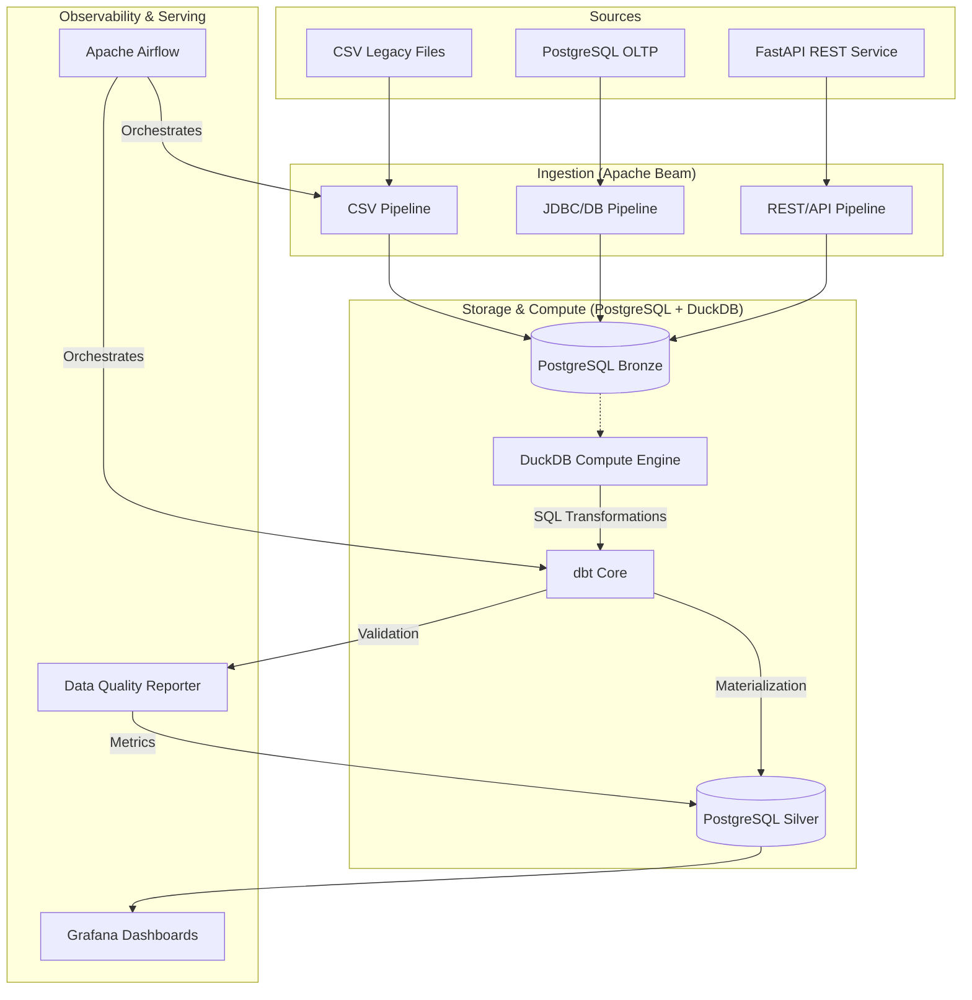

# 🚀 E-Commerce Data Platform — PFE Data Engineering

Industrial-grade, end-to-end data platform designed for a high-performance E-commerce environment. This project implements a **Medallion Architecture (Bronze/Silver)** with a strategic separation of storage and compute to ensure scalability, data quality, and observability.

---

## 🏗️ Architecture: Strategic Separation of Concerns

Our architecture leverages **PostgreSQL** for persistent storage (Landing/Bronze) and **DuckDB** as a high-performance OLAP engine for transformations (Silver).



---

## 🌟 Core Features

- **Multi-Source Ingestion**: Unified pipelines for CSV, SQL Databases, and REST APIs using **Apache Beam**.
- **Medallion Architecture**:
    - **Bronze**: Raw data landing with governance metadata (`_ingested_at`, `_batch_id`).
    - **Silver**: Cleaned, deduplicated, and anonymized (PII hashing) "Source of Truth".
- **Compute/Storage Synergy**: PostgreSQL handles the data weight while **DuckDB** provides lightning-fast analytical processing.
- **Automated Data Quality**: Integrated dbt tests with a custom **DQ Reporter** that logs metrics and enforces a "Fail-Fast" policy.
- **Enterprise Observability**: Real-time monitoring of infra and data health via **Prometheus** and **Grafana**.

---

## 🛠️ Technology Stack

| Role | Technology | Implementation |
| :--- | :--- | :--- |
| **Ingestion** | Apache Beam | Batch processing (CSV, JDBC, REST) |
| **Storage** | PostgreSQL 16 | Landing (Bronze) & Serving (Silver/Gold) |
| **Analytical Engine** | DuckDB | OLAP moteur (separation of storage/compute) |
| **Transformation** | dbt-core + dbt-duckdb | SQL modelling, lineage, and documentation |
| **Orchestration** | Apache Airflow | DAG scheduling and pipeline monitoring |
| **Data Quality** | dbt tests + Custom Python | Automated validation and DQ metrics table |
| **Observability** | Prometheus + Grafana | Infrastructure & Data Quality Dashboards |

---

## 📂 Project Structure

```bash
pfe-data-platform/
├── airflow/            # Orchestration: DAGs and Airflow configuration
├── api/                # Mock REST API (FastAPI) for product/seller data
├── data/               # Raw datasets (excluded from git)
├── dbt/                # Transformation layer: Models (Bronze/Silver), Macros
├── docker/             # Infrastructure: Docker Compose, Prometheus/Grafana configs
├── src/                # Python Core Logic
│   ├── ingestion/      # Apache Beam pipelines
│   ├── quality/        # Custom Data Quality reporting logic
│   └── scripts/        # Utility and initialization scripts
├── tests/              # Pytest suite for pipelines and logic
└── requirements.txt    # Production dependencies
```

---

## 🚀 Getting Started

### 1. Prerequisites
- **Python 3.11+**
- **Docker Desktop** (with Compose v2)
- **Git**

### 2. Installation & Setup
```bash
# Clone the repository
git clone https://github.com/HamzaElOuali/pfe-data-platform.git
cd pfe-data-platform

# Setup Virtual Environment
python -m venv venv
source venv/bin/activate  # venv\Scripts\activate on Windows

# Install Dependencies
pip install -r requirements.txt
```

### 3. Environment Configuration
Copy the `.env.example` to `.env` and adjust the credentials for PostgreSQL and APIs.

### 4. Launch Services
```bash
cd docker
docker-compose up -d
```

---

## 📊 Data Quality & Governance

We implement a rigorous validation process:
- **Anonymization**: PII data (Customer IDs) is hashed via SHA256 in the Silver layer.
- **Deduplication**: Generic dbt macros ensure row-level uniqueness before materialization.
- **DQ Scoring**: Our `dq_reporter.py` script scans dbt results to calculate a global **Data Quality Score** stored in `quality.dq_metrics`.

---

## 📈 Monitoring & Observability

Access the following dashboards to monitor the platform:
- **Airflow UI**: `http://localhost:8080` (admin/admin)
- **Grafana**: `http://localhost:3000` (admin/admin)
- **pgAdmin**: `http://localhost:5050` (admin/admin)

---

## 🔍 Troubleshooting

### My data isn't showing up in Grafana?
1. **Case Sensitivity**: PostgreSQL is case-sensitive. Ensure all table names are lowercase in `dbt_project.yml`.
2. **Schema Path**: Grafana needs to point specifically to `bronze` or `silver` schemas. Update the SQL Search Path in the Grafana Data Source settings.
3. **Data Types**: Ensure temporal columns are cast to `TIMESTAMP` in dbt (required for Grafana time-series graphs).

---

**Author**: Hamza EL OUALI
**Supervised by**: Naoufal (Alten)
